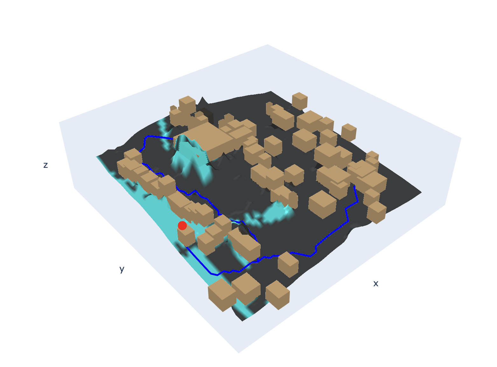
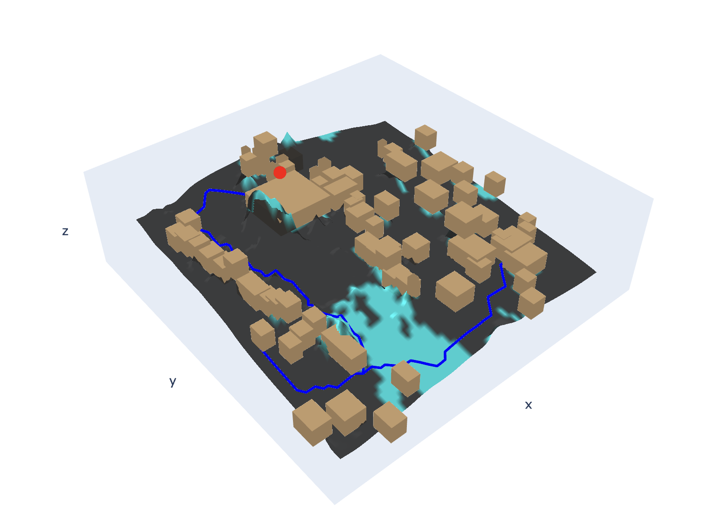
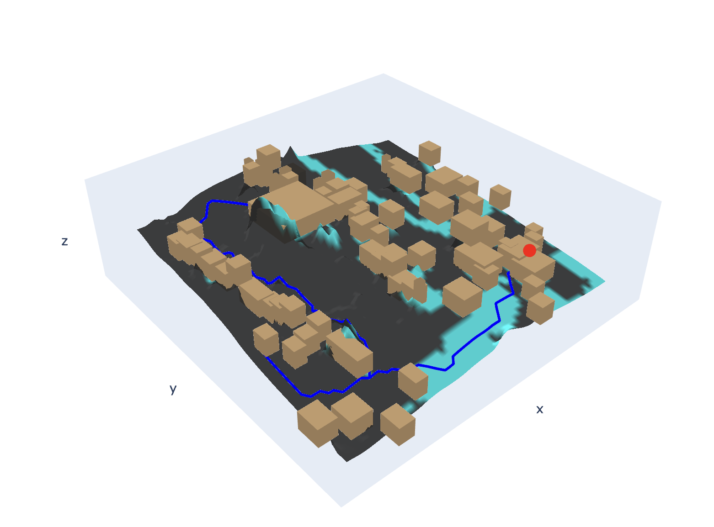

# LAMP: Spatial Analytics Pipeline for the Necropolis of El Bagawat

## 1. GitHub Repository Link
* **Link:** https://github.com/aniket2405/lamp_test

## 2. Description
**Overview:** This repository contains a complete spatial data science pipeline developed for the Late Antiquity Modeling Project (LAMP). It reconstructs the embodied experiences of the El Bagawat necropolis by predicting probabilistic human transit patterns and calculating true 3D visual occlusion.

**Requirements Achieved:**
* **Task 1:** ML-driven pathfinding accounting for topography, surface friction, and specific building entrances. Rendered as a GIS vector layer.
* **Task 2:** 3D ray-traced viewsheds calculating gradients of visibility across a true 3D landscape (accounting for Z-heights of mud-brick tombs). Rendered as a GIS vector layer.
* **Bonus:** Interactive 3D volume rendering of the landscape and viewsheds.
* **Developer UX:** Interactive `demo.ipynb` wrapper for rapid testing.

## 3. Condition Logic (The Architecture)

### Task 1: Probabilistic Path Tracing
* **Logic:** Replaced standard "least-cost path" (water-flow) algorithms with a probabilistic spatial network. The algorithm injects severe friction penalties for intersecting solid mud-brick tombs, while creating zero-friction nodes at verified architectural entrances (e.g., Doorways).
* **Result:** Generates a braided network of likely transit corridors, proving that the primary southern thoroughfare was the path of least resistance.

### Task 2: 3D Viewshed Ray-Tracing
* **Logic:** Standard 2D planimetric tools fail to account for building heights. This pipeline utilizes a 2.5D Digital Elevation Model (`DEM_Subset-WithBuildings.tif`) to cast mathematical line-of-sight rays. The condition evaluates the slope angle of the ray: if an intervening building's Z-height exceeds the maximum slope seen so far, the ray terminates, creating an architectural shadow (roof-edge occlusion).
* **Dynamic Targeting:** The observer logic is highly modular, engineered to calculate visual occlusion from *any given point* or building ID on the site, at a biologically accurate human eye level (1.6m).

## 4. Logging Implementation
**Pipeline Execution Logs:** The scripts utilize a dual-handler logging architecture via Python's `logging` module.

Outputs are synchronously printed to `stdout` for real-time monitoring and permanently saved to timestamped text files (e.g., `logs/lamp_pipeline_20260321.log`). Log milestones include:
* Data ingestion status and missing file flags.
* Coordinate transformations (Pixel to Geocoordinate translation).
* Ray-casting counts (e.g., `[INFO] Casting true 3D rays (Shadows enabled)...`).
* Mesh generation and explicit 3D geometry extrusion stages.

## 5. How to Run Locally

**1. Clone the Repository:**
```bash
git clone https://github.com/aniket2405/lamp_test
cd lamp_test
```

**2. Set Up Virtual Environment:**
```bash
python3 -m venv venv
source venv/bin/activate  # On Windows use: venv\Scripts\activate
```

**3. Install Dependencies:**
```bash
pip install -r requirements.txt
```

**4. Data Placement:** Ensure the raw DEM files and shapefiles are placed in the `data/` directory. *(Note: empty directories are tracked via `.gitkeep`).*

**5. Execution Order:**

You can execute the pipeline in two ways:

#### Option A: Interactive Demo (Recommended for Quick Review)
If you prefer a guided walkthrough, open the `demo.ipynb` Jupyter Notebook in the root directory. This notebook serves as a wrapper for the entire pipeline, providing cell-by-cell execution and immediate visual previews of the generated maps.

#### Option B: Command Line Interface (CLI)
For a production-style execution, run the scripts in order from your terminal:

```bash
# 1. Prepare doorway vectors
python scripts/01_preprocess_doorways.py

# 2. Generate spatial network
python scripts/02_task1_pipeline.py

# --- NOTE ON TASK 2 ---
# You can open the Task 2 scripts and modify OBSERVER_PT_ID to 
# dynamically calculate visibility from any building (e.g., 154, 180, 224).

# 3. Generate the 2D GIS vector layer (dynamically named by ID)
python scripts/03a_task2_viewshed.py

# 4. Generate the interactive browser-based 3D volume
python scripts/03b_task2_3d_render.py
```

**6. Viewing in QGIS:**
To verify the vector outputs, open QGIS and import `DEM_Subset-Original.tif` as a Hillshade base layer. Set the Hillshade blending mode to **Multiply** over a satellite base map for true 3D depth. Drag and drop the generated `Task1_Global_Minimum_Path.shp` and `Task2_Viewshed.shp` files over the terrain. Apply a 60% opacity to the viewshed layer to visualize the precise gradient of visibility.

## 7. Test Results & Visual Proof

**Generated Artifacts:**
* `output/Marks_Brief1_with_Vectors.shp`
* `output/Task1_Global_Minimum_Path.shp`
* `output/Task1_Probabilistic_Network.shp`
* `output/Task2_Viewshed_[ID].shp` (Dynamically generated based on observer point)

**Developer Note:** While the static previews below demonstrate results for Buildings 154, 180, and 224, the pipeline is fully dynamic. Running the `demo.ipynb` or the CLI scripts allows for real-time recalculation of these viewsheds from any building ID on the site.

### Task 1: Anisotropic Pathfinding Simulation
This rendering demonstrates the probabilistic spatial network. While the pipeline is **fully dynamic**—allowing users to input any combination of building IDs to generate custom transit routes—this specific simulation anchors the network to the three critical observer points provided in the test data (Buildings 154, 180, and 224). 

These specific points were chosen because they represent distinct topological zones (a boundary structure, a central complex, and an eastern tomb), providing a rigorous test of the algorithm. By injecting high friction penalties for solid mud-brick structures and low friction for verified doorways, the algorithm successfully traces the global minimum path (red) connecting these anchor points across the landscape.


Figure 1: The predicted transit pathway navigating the necropolis topology, highlighting the avoidance of 3D structures and utilization of mapped doorways.

### Task 2: Vector Viewsheds & 3D Interactive Volumes
The pipeline dynamically calculates viewsheds from any given point. Below are the results from three critical observer points: a western boundary structure (154), the central complex (180), and an eastern tomb (224).
* **Top Row:** Mathematically ray-traced 2D GIS vector layers (Cyan) draped over satellite imagery and 3D hillshades.
* **Bottom Row:** Interactive 3D browser renders showcasing roof-edge occlusion and true Z-axis shadows.

| Observer Point | Building 154 | Building 180 | Building 224 |
| :--- | :--- | :--- | :--- |
| **2D GIS Vector** |  |  |  |
| **3D Volume** |  |  |  |